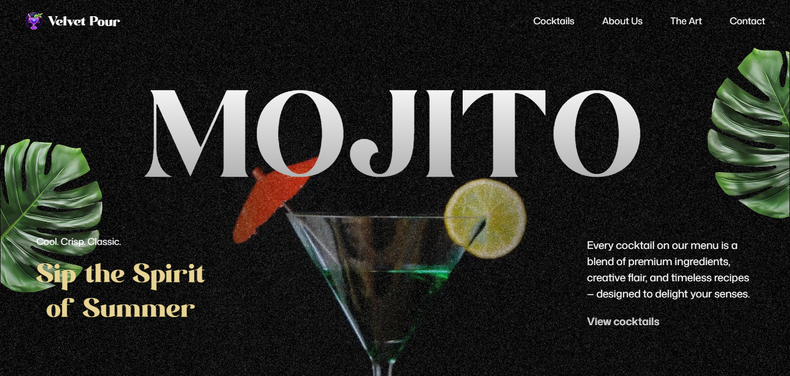
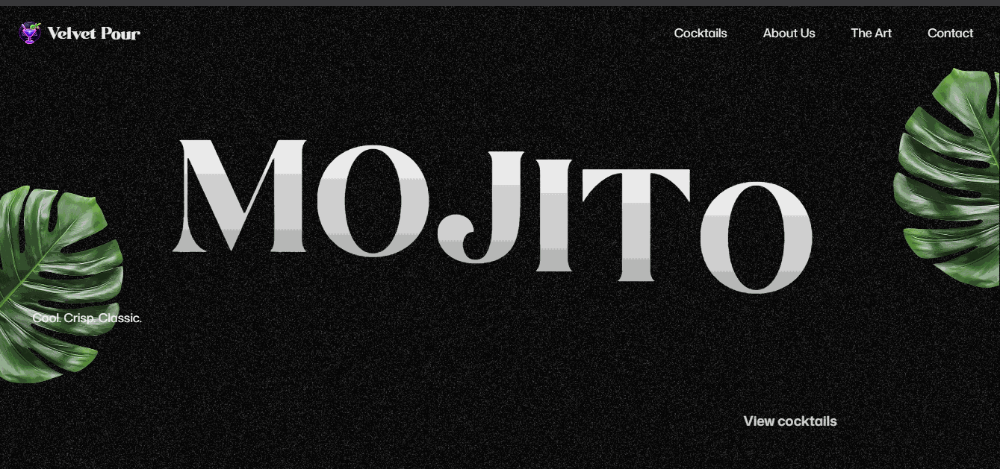
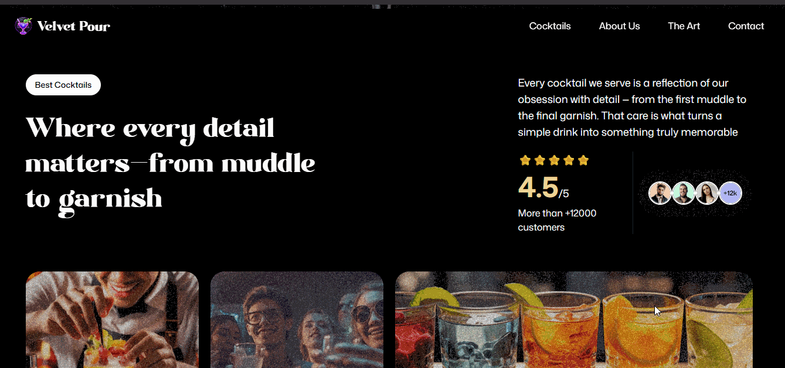
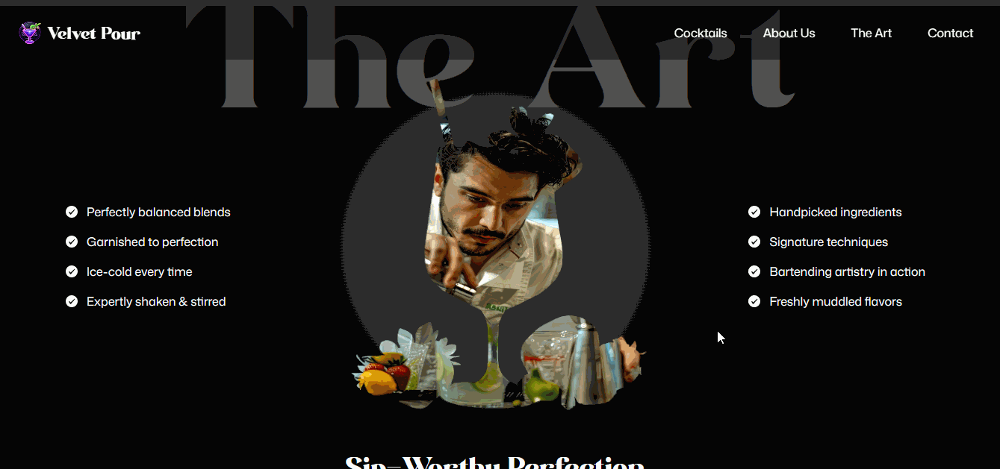

# 🍸 RestoBar - Enjoy Every Sip

A refreshing and animated **restaurant bar landing page** built with **React**, **GSAP**, and **Tailwind CSS** — delivering smooth scroll-triggered animations and vibrant visual storytelling.

🌐 **Live Demo**:

[](https://restrobar-kappa.vercel.app/)

---

## ✨ Features

🎞️ **GSAP Animations**  
🌀 Scroll-based motion with `ScrollTrigger` and text animations via `SplitText`.

🎨 **Tailwind CSS Styling**  
Fully responsive and utility-first design, optimized for all screen sizes.

⚛️ **Modular React Components**  
Reusable and readable structure using functional components.

📼 **Background Video**  
Immersive background video that blends with the theme.

🧠 **Smooth User Experience**  
Minimal transitions and thoughtful interactions.

---

## 🛠️ Tech Stack

| Technology  | Description                            |
| ----------- | -------------------------------------- |
| ⚛️ React    | UI Library for building components     |
| 🎞️ GSAP     | Animation library (with ScrollTrigger) |
| 🌬️ Tailwind | Utility-first CSS framework            |
| ⚡ Vite     | Fast build tool for modern web apps    |

---

## 📸 Screenshots

### 🖼️ Hero Section



### 🧾 About Scroll Animation



### 📬 Art Section



---

## 📂 Folder Structure

```text
mojito-gsap/
├── public/
│   └── assets/            # Images and background videos
├── src/
│   ├── components/        # Header, Hero, Contact, etc.
│   ├── constants/         # Static menu, social links
│   ├── App.jsx
│   └── main.jsx
├── tailwind.config.js
├── vite.config.js
├── index.html
└── README.md
```

---

## 🚀 Getting Started

### ✅ Prerequisites

- Node.js ≥ 16.x
- npm or yarn

### 📦 Installation

```bash
# Clone the repo
git clone https://github.com/SouravBhardwaj997/mojito-gsap.git

# Move into the folder
cd mojito-gsap

# Install dependencies
npm install

# Start development server
npm run dev
```

<p style="text-align:center;">Made with 💚 and 🍹 by  <b>Sourav Bhardwaj<b>.<p>
